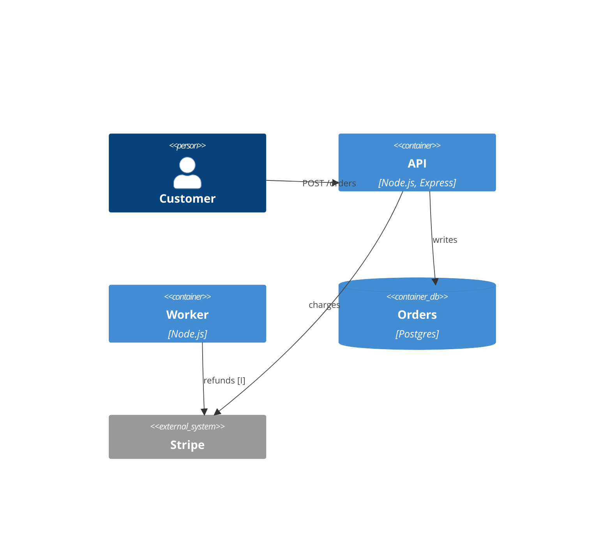
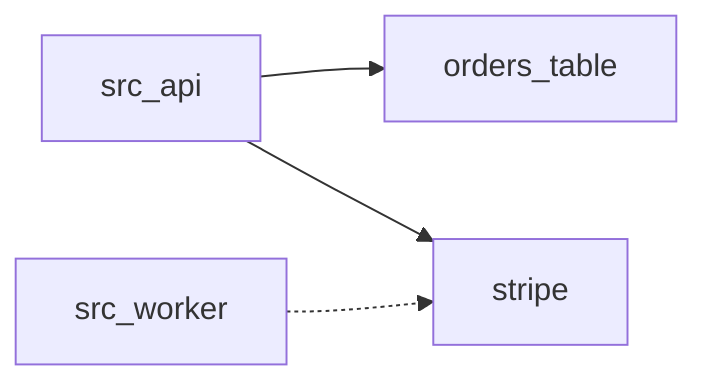
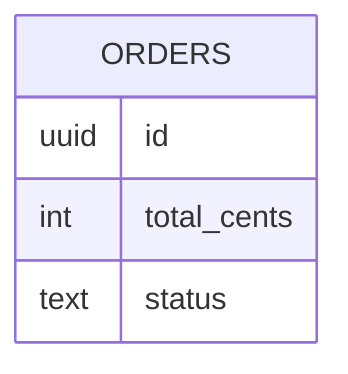

# Technical architecture

## First-principles core
Everything in this service reduces to three facts: an order row in Postgres, a charge request to Stripe, and an order.created event on Kafka. The validation rule in src/api/validate.ts:21 [C] guards the first, the payment client in src/api/pay.ts:8 [C] performs the second, and the publisher in src/api/events.ts:5 [I] emits the third. Every other module exists to wire these together, configure them, or run them.

## Containers (C4 L2)
The system has two runtime containers sharing one codebase and one database.

Source: src/api/server.ts:3, src/worker/index.ts:1 [C]

## Components (C4 L3)

Source: src/api/routes.ts:12, src/worker/refund.ts:4 [I]

### api
`ckb:component:src/api`

Express application that serves the order endpoint, validates input, charges through Stripe, and writes the order. Entry at src/api/server.ts:3 [C]. It is the only component that writes to the orders table, which keeps ownership of the aggregate in one place.

### worker
`ckb:component:src/worker`

Background process for refunds. It appears to poll for refund requests and call Stripe; the scheduling mechanism is not visible. Entry at src/worker/index.ts:1 [I].

## Data model

Source: migrations/001_orders.sql:1 [C]

The order lifecycle is created, charged, then optionally refunded. The status column carries these states. [I]

## Interfaces

### POST /orders
`ckb:interface:http:provides:shop-api:POST:/orders`

Creates an order. Declared at src/api/routes.ts:12 [C] and specified in openapi.yaml:1 [C]. It returns 201 on success and 422 when validation fails.

The service also consumes the Stripe charges endpoint, declared at src/api/pay.ts:8 [C], and publishes the order.created topic from src/api/events.ts:5 [I]. Full listings are in the generated reference.

## Dependencies
| Dependency | Direction | Why it matters | Source |
|---|---|---|---|
| express | upstream library | HTTP server for the API | package.json:9 [C] |
| jest | test only | Unit tests | package.json:14 [C] |
| Stripe API | upstream service | Payment authority | src/api/pay.ts:8 [C] |
| Kafka | downstream broker | Order events for fulfilment | src/api/events.ts:5 [I] |

## Configuration reference
| Key | Purpose | Secret | Source |
|---|---|---|---|
| PORT | HTTP listen port | no | src/api/server.ts:5 [C] |
| DATABASE_URL | Postgres connection string | yes | src/db.ts:2 [C] |
| STRIPE_KEY | Stripe API credential | yes | src/api/pay.ts:3 [C] |

## Deployment
The image is built from Dockerfile:1 [C] and deployed to Kubernetes as the shop-api service on port 8080, defined in deploy/k8s/deployment.yaml:4 [C]. Staging and production environments exist; how traffic is promoted between them is not visible. [?]

## Non-functional posture
- Security: secrets come from environment variables only, never from files in the repository. [C]
- Reliability: no retry or idempotency key is visible on the charge call, so a timeout could double charge. [I]
- Performance: no caching layer; every request touches Postgres and Stripe. [I]
- Observability: no metrics library is declared in the manifest. [?]
- Compliance: card data never transits the service because Stripe tokenises it client side. [I]
