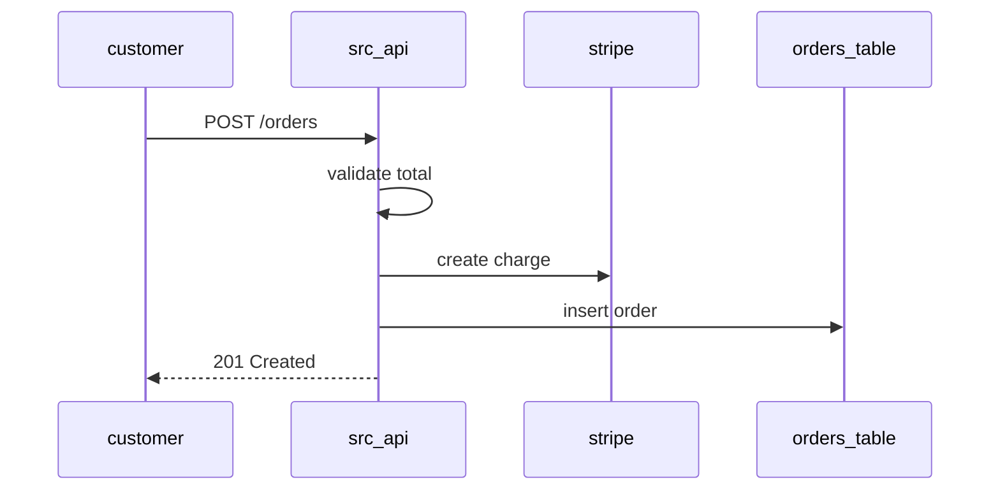
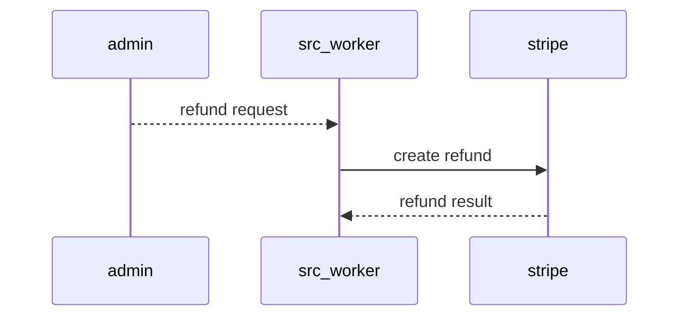

# Functional workflows

## Actors
- Customer: submits orders through a storefront client that is not part of this repository. [I]
- Support admin: requests refunds for disputed or failed orders. [I]
- Stripe: external payment authority that accepts charges and refunds. [C]
- Fulfilment consumer: downstream system that reads order events. [I]

## Capabilities
1. Accept and validate a new order, as declared at src/api/routes.ts:12 [C].
2. Charge the customer through Stripe, as implemented at src/api/pay.ts:8 [C].
3. Publish an order.created event for downstream systems from src/api/events.ts:5 [I].
4. Refund a previously charged order asynchronously from src/worker/refund.ts:4 [I].

## Workflows

### Place order
`ckb:workflow:place-order`

Trigger: an HTTP request to the order endpoint. Input is a cart with line items and a total; output is the stored order with its identifier.

Source: src/api/routes.ts:12, src/api/validate.ts:21 [C]

1. The route handler receives the request at src/api/routes.ts:12 [C].
2. The total is validated against the positive-total rule at src/api/validate.ts:21 [C].
3. A charge is created at src/api/pay.ts:8 [C].
4. The order row is written and the event is published at src/api/events.ts:5 [I].

### Refund order
`ckb:workflow:refund-order`

Trigger: a refund request created by a support admin. How the request reaches the worker is not visible in the code. [?]

Source: src/worker/refund.ts:4 [?]

1. The worker picks up the request; the queue or schedule is unknown. [?]
2. The worker calls the Stripe refund endpoint at src/worker/refund.ts:4 [I].
3. The order status is updated to refunded; the write site was not found. [?]

## State machines
Orders move from created to charged, and from charged to refunded. A failed charge leaves no row because the insert happens after the charge succeeds. The status column is defined in migrations/001_orders.sql:1 [C], but the allowed transitions are only implied by the call order in the route handler. [I]

## Error and edge handling
- Validation failures return 422 and write nothing, as seen at src/api/validate.ts:21 [C].
- Stripe errors propagate as 502 to the caller; no retry is visible. [I]
- Event publish failures after a successful insert are not compensated, so an order can exist without an event. [I]
- Duplicate submissions are not deduplicated by any idempotency key. [?]
