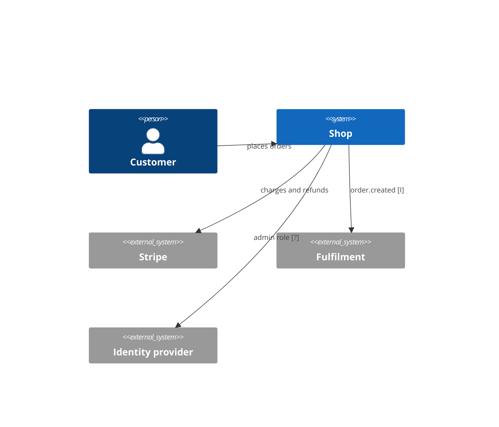

# System context and gaps

## System context (C4 L1)
Shop owns order intake and the orders table. It delegates payment to Stripe, identity to an external provider, and fulfilment to a downstream consumer of its events.

Source: src/api/pay.ts:8, src/api/events.ts:5 [I]

## Contracts exposed
| Contract | Kind | Source |
|---|---|---|
| POST /orders | HTTP | src/api/routes.ts:12 [C] |
| order.created | Kafka event | src/api/events.ts:5 [I] |
| OpenAPI document | spec | openapi.yaml:1 [C] |

## Contracts consumed
| Contract | Kind | Source |
|---|---|---|
| Stripe charges | HTTP | src/api/pay.ts:8 [C] |
| Stripe refunds | HTTP | src/worker/refund.ts:4 [I] |
| Admin role claim | token claim | src/api/auth.ts:30 [?] |

## Assumptions
- The storefront client sends totals in cents, matching the integer column in the migration. [I]
- Kafka is provided by the platform; no broker configuration appears in this repository. [?]
- One Postgres database per environment, addressed by the connection string environment variable. [I]

## Risks and tech debt
- No idempotency key on order creation, so client retries can create duplicate orders and duplicate charges. [I]
- The charge happens before the insert; a crash between them leaves a charge with no order. Seen at src/api/pay.ts:8 [I].
- The admin rule has no tests; see the traceability table in the business rules document. [C]
- Event publishing is fire and forget with no outbox, so downstream systems can miss orders. [I]

## Open questions
| ID | Question | Why it matters | Where to look |
|---|---|---|---|
| Q-who-issues-admin-role | Which system issues the admin role claim? | The refund rule depends on it | src/api/auth.ts:30 [?] |
| Q-refund-request-path | How do refund requests reach the worker? | Determines whether the admin rule can be bypassed | src/worker/index.ts:1 [?] |
| Q-kafka-cluster-owner | Who owns the Kafka cluster and topic retention? | Event loss and replay policy | deploy/k8s/deployment.yaml:4 [?] |
